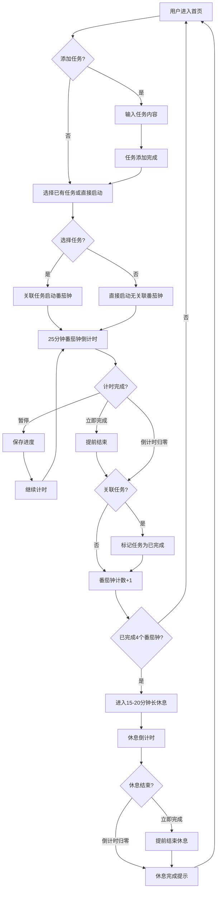

## 1. Product Overview
番茄钟待办计时网站是一款面向个人用户的轻量化计时工具，结合待办任务管理与番茄工作法，帮助用户提升专注效率和时间管理能力。
- 核心价值：通过任务+计时的组合，让用户清晰管理每日任务并通过番茄钟增强专注力
- 目标用户：学生、职场人士、自由职业者等需要时间管理的个人用户

## 2. Core Features

### 2.1 Feature Module
1. **首页（任务列表）**：每日待办任务管理，番茄钟计时启动入口
2. **番茄钟计时页**：25分钟倒计时，支持暂停/继续/重置/立即完成
3. **休息计时页**：15-20分钟长休息倒计时，与番茄钟交替循环
4. **数据统计区**：每日任务完成情况可视化统计
5. **设置区**：番茄钟时长、休息时长、主题切换配置

### 2.2 Page Details
| Page Name | Module Name | Feature description |
|-----------|-------------|---------------------|
| 首页/任务列表页 | 任务新增 | 手动输入文字创建自定义待办任务 |
| 首页/任务列表页 | 任务展示 | 按日期分组展示，区分待完成/已完成状态 |
| 首页/任务列表页 | 任务操作 | 支持任务删除、状态手动修改 |
| 首页/任务列表页 | 数据统计 | 每日统计已完成任务总数，可视化展示 |
| 首页/任务列表页 | 计时入口 | 选择任务启动番茄钟或直接启动无关联番茄钟 |
| 番茄钟计时页 | 倒计时 | 25分钟默认时长，支持自定义修改 |
| 番茄钟计时页 | 控制按钮 | 暂停/继续/重置/立即完成 |
| 番茄钟计时页 | 计数规则 | 累计完成4个番茄钟后强制进入长休息 |
| 番茄钟计时页 | 视觉特效 | 结束时展示礼花动画 |
| 休息计时页 | 倒计时 | 15-20分钟默认时长，支持自定义调整 |
| 休息计时页 | 控制按钮 | 暂停/继续/重置/立即完成 |
| 休息计时页 | 结束逻辑 | 倒计时结束自动返回任务选择界面 |
| 主题设置 | 主题系统 | 默认紫色主题，内置多套配色主题一键切换 |
| 响应式适配 | 竖屏提示 | 手机/平板竖屏全屏弹窗提示旋转设备 |

## 3. Core Process

### 核心主流程
用户添加待办任务 → 选择任务/直接启动番茄钟 → 25分钟计时 → 标记任务完成 → 累计4个番茄钟 → 15-20分钟长休息 → 返回任务选择页面

### 分支流程
- 场景1：不选择任务直接启动番茄钟，不计入指定任务完成数
- 场景2：计时/休息过程中手动点击「立即完成」提前终止
- 场景3：竖屏访问时弹出提示引导切换横屏

## 4. User Interface Design

### 4.1 Design Style
- **主色调**：默认紫色主题 (#7C3AED)，支持多主题切换（番茄红、薄荷绿、海洋蓝、日落橙等）
- **按钮风格**：圆角按钮，柔和阴影，悬停动效
- **字体**：中文优先，使用系统中文字体栈（PingFang SC, Microsoft YaHei）
- **布局风格**：卡片式布局，分区清晰
- **图标风格**：简洁线性图标，现代简洁

### 4.2 Page Design Overview
| Page Name | Module Name | UI Elements |
|-----------|-------------|-------------|
| 首页 | 任务列表区 | 卡片式任务列表，待完成/已完成分区，复选框状态切换 |
| 首页 | 计时主面板 | 大号圆形倒计时数字，暂停/继续/重置/立即完成按钮 |
| 首页 | 数据统计区 | 当日完成番茄钟数、完成任务数，进度条可视化 |
| 首页 | 设置入口 | 齿轮图标按钮，打开设置弹窗 |
| 番茄钟计时页 | 倒计时 | 大号数字显示，圆形进度环，视觉醒目 |
| 番茄钟计时页 | 控制按钮 | 四个功能按钮水平排列，主次分明 |
| 休息计时页 | 倒计时 | 与番茄钟样式一致，配色区分 |
| 设置弹窗 | 番茄钟设置 | 时长调节滑块 |
| 设置弹窗 | 休息设置 | 时长调节滑块 |
| 设置弹窗 | 主题选择 | 多主题色块展示，点击切换 |
| 竖屏提示 | 全屏提示 | 旋转设备图标+引导文字，半透明遮罩 |

### 4.3 Responsiveness
- **PC端**：完美适配1080P屏幕，浏览器100%缩放比例，三栏布局（左侧任务区+中间计时区+右侧统计区）
- **移动端/平板（横屏）**：自适应布局，双栏或单栏切换
- **移动端/平板（竖屏）**：全屏弹窗提示用户旋转设备，禁止操作
- **交互优化**：触屏友好按钮大小，手势滑动支持

### 4.4 Visual Effects
- 番茄钟结束/休息开始时：Canvas礼花动画特效（纯视觉，无声音）
- 按钮悬停/点击动效：柔和缩放、阴影变化
- 倒计时数字刷新：平滑过渡动画
- 主题切换：颜色平滑过渡