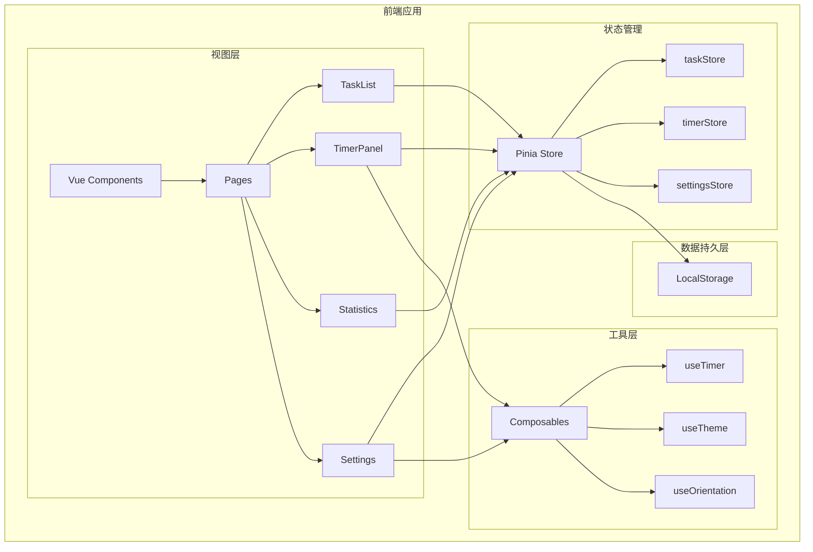
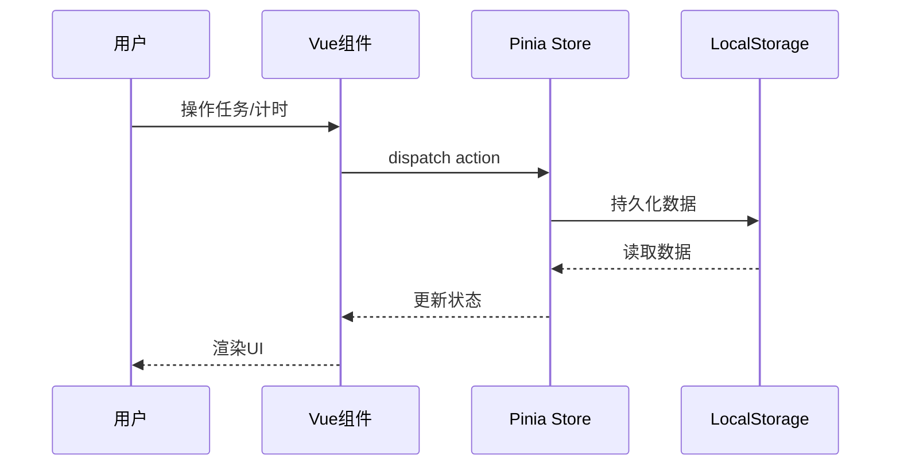
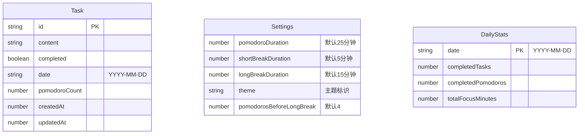

## 1. Architecture Design

### 整体架构图


### 数据流向


## 2. Technology Description
- **前端框架**：Vue 3 + TypeScript
- **构建工具**：Vite
- **CSS框架**：Tailwind CSS 3
- **状态管理**：Pinia
- **路由**：Vue Router
- **图标库**：Lucide Vue Next
- **动画**：CSS Animations + Canvas（礼花特效）
- **数据存储**：浏览器 LocalStorage
- **包管理器**：pnpm

## 3. Route Definitions
| Route | Purpose |
|-------|---------|
| / | 首页 - 任务列表与计时主面板 |
| /timer | 番茄钟/休息计时全屏模式 |

## 4. Project Structure
```
tomatoClock/
├── src/
│   ├── components/           # 可复用组件
│   │   ├── TaskList.vue       # 任务列表组件
│   │   ├── TaskItem.vue       # 单个任务项
│   │   ├── TimerPanel.vue     # 计时主面板
│   │   ├── TimerControls.vue  # 计时控制按钮
│   │   ├── CircularProgress.vue # 圆形进度环
│   │   ├── Statistics.vue     # 数据统计组件
│   │   ├── SettingsModal.vue  # 设置弹窗
│   │   ├── ThemeSwitcher.vue  # 主题切换组件
│   │   ├── OrientationWarning.vue # 竖屏提示组件
│   │   └── CelebrationEffect.vue # 礼花特效组件
│   ├── views/                # 页面视图
│   │   └── Home.vue           # 首页视图
│   ├── stores/               # Pinia状态管理
│   │   ├── task.ts            # 任务状态
│   │   ├── timer.ts           # 计时器状态
│   │   └── settings.ts        # 设置状态
│   ├── composables/          # 可复用逻辑
│   │   ├── useTimer.ts        # 计时器逻辑
│   │   ├── useTheme.ts        # 主题切换逻辑
│   │   ├── useOrientation.ts  # 屏幕方向检测
│   │   └── useCelebration.ts  # 礼花特效逻辑
│   ├── utils/                # 工具函数
│   │   ├── storage.ts         # LocalStorage封装
│   │   ├── date.ts            # 日期工具
│   │   └── constants.ts       # 常量定义
│   ├── types/                # TypeScript类型定义
│   │   └── index.ts           # 全局类型
│   ├── assets/               # 静态资源
│   ├── router/               # 路由配置
│   │   └── index.ts
│   ├── App.vue               # 根组件
│   ├── main.ts               # 入口文件
│   └── style.css             # 全局样式
├── index.html
├── package.json
├── tsconfig.json
├── vite.config.ts
├── tailwind.config.js
├── postcss.config.js
└── .env
```

## 5. Data Model

### 5.1 数据模型定义


### 5.2 TypeScript 类型定义
```typescript
// 任务类型
interface Task {
  id: string;
  content: string;
  completed: boolean;
  date: string; // YYYY-MM-DD
  pomodoroCount: number;
  createdAt: number;
  updatedAt: number;
}

// 设置类型
interface Settings {
  pomodoroDuration: number; // 分钟
  longBreakDuration: number; // 分钟
  theme: string;
  pomodorosBeforeLongBreak: number;
}

// 每日统计
interface DailyStats {
  date: string;
  completedTasks: number;
  completedPomodoros: number;
  totalFocusMinutes: number;
}

// 计时器状态
type TimerMode = 'pomodoro' | 'break';
type TimerStatus = 'idle' | 'running' | 'paused';

interface TimerState {
  mode: TimerMode;
  status: TimerStatus;
  remainingTime: number; // 秒
  totalTime: number; // 秒
  currentTaskId: string | null;
  completedPomodoros: number;
}

// 主题配置
interface ThemeConfig {
  id: string;
  name: string;
  primaryColor: string;
  secondaryColor: string;
  backgroundColor: string;
  textColor: string;
}
```

## 6. API Definitions
本项目为纯前端应用，无需后端API。所有数据通过 LocalStorage 进行持久化。

### LocalStorage 存储结构
```typescript
// 存储键名常量
const STORAGE_KEYS = {
  TASKS: 'tomato_clock_tasks',
  SETTINGS: 'tomato_clock_settings',
  STATS: 'tomato_clock_daily_stats',
  TIMER_STATE: 'tomato_clock_timer_state'
};

// 存储工具函数
const storage = {
  getTasks(): Task[]
  saveTasks(tasks: Task[]): void
  getSettings(): Settings
  saveSettings(settings: Settings): void
  getStats(date: string): DailyStats
  saveStats(stats: DailyStats): void
  getTimerState(): TimerState
  saveTimerState(state: TimerState): void
  clearAll(): void
};
```

## 7. Key Technical Decisions

### 7.1 计时器实现
- 使用 `setInterval` 实现倒计时，每秒更新
- 组件卸载时保存计时器状态到 LocalStorage
- 支持页面刷新后恢复计时状态

### 7.2 礼花特效实现
- 使用 Canvas API 绘制粒子动画
- 触发时机：番茄钟结束、休息开始
- 纯视觉效果，不播放任何声音

### 7.3 竖屏检测实现
- 使用 `window.matchMedia('(orientation: portrait)')` 监听屏幕方向
- 竖屏时显示全屏遮罩提示
- 横屏时自动恢复正常显示

### 7.4 主题切换实现
- 使用 CSS 变量（Custom Properties）实现主题
- 预定义多套主题配色
- 用户选择的主题持久化到 LocalStorage

### 7.5 数据持久化
- 所有数据存储在 LocalStorage
- 按日期维度组织任务数据
- 启动时自动加载当日数据
- 定时保存统计数据